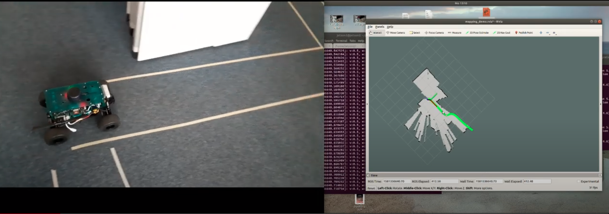
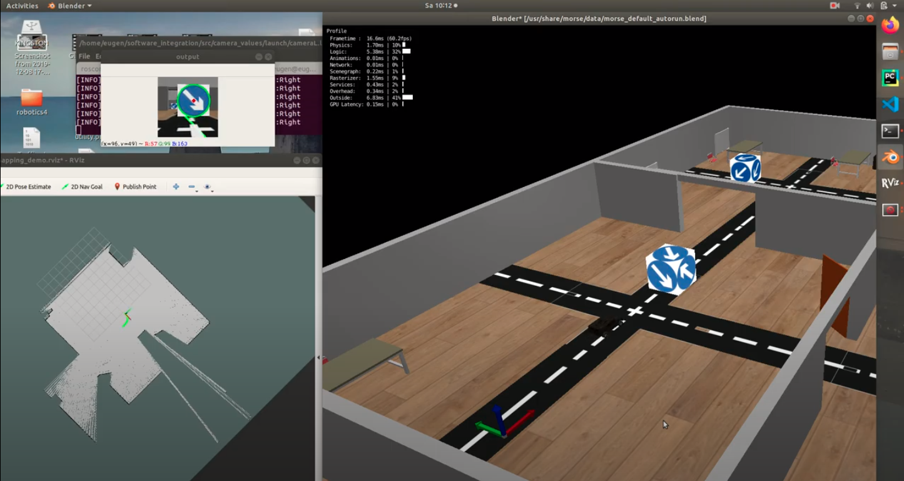

This project presents a small scale autonomous driving car

1. Traffic line detection (OpenCV though transform) & following

2. Traffic sign detection & recognition (CNN model)

3. SLAM with EKF for mapping & localization

4. 2D spline function for path planning

5. Stanley steering controller for path following

Results
 
https://www.youtube.com/watch?v=wZoVcA4jXVs&t=11s

https://www.youtube.com/watch?v=HdXiDNB-Irk

For extra detail to run the project please use User_Manual_AAIP.pdf

